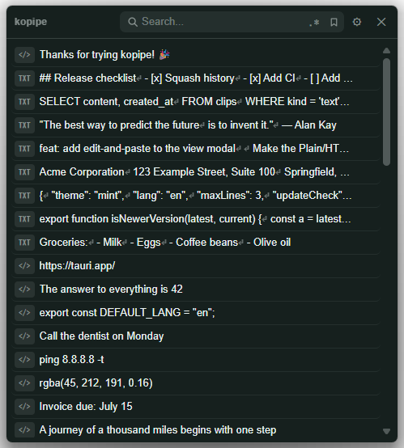

<p align="center">
  
</p>

# kopipe

[](https://github.com/lakepuka/kopipe/actions/workflows/ci.yml)

A **fast, sleek**, fully local clipboard‑history app for Windows. kopipe
sits quietly in the tray, instantly captures everything you copy (text,
files/folders, and images), and pastes any past item back in a snap. Double‑tap
**Shift** to summon it anywhere.

Your clipboard is sensitive, so kopipe keeps everything on your PC: no account,
no cloud, no telemetry. See [Privacy](#privacy).

kopipe（コピペ）は、**おしゃれでサクサク動く** Windows のクリップボード履歴アプリ。コピーしたテキスト・ファイル・画像を片っ端から自動で記録し、**Shift** 2回でパッと呼び出してサッと貼り付け。しかも全部あなたの PC の中だけで完結します。

> kopipe is Windows‑only (it relies on Win32 clipboard APIs).



## Features

- **Private by design**: history lives only on your machine — nothing is uploaded
- Automatic clipboard history: text, files/folders (`CF_HDROP`), images (PNG)
- Rich text: keeps HTML so links/formatting survive a paste; view Plain / HTML / Web
- Bookmark items, regex / keyword search, deduplicated history
- Summon with a double‑tap of Shift (or Ctrl, or a custom shortcut)
- Themes, English / 日本語, optional launch at PC login (runs in the tray)

## Install

1. Download the latest `kopipe_x.y.z_x64-setup.exe` from the
   [Releases page](https://github.com/lakepuka/kopipe/releases).
2. Run the installer.
3. On first launch a short setup guide appears (language, welcome, optional
   auto‑start). After that kopipe stays in the tray — press **Shift twice** to open it.

Requirements: Windows 10/11. The WebView2 runtime is preinstalled on Windows 11
(the installer fetches it automatically if missing).

> The installer isn't code‑signed yet, so Windows SmartScreen may warn
> "unknown publisher". Choose **More info → Run anyway**.

### Verify your download (optional)

Because the installer isn't signed, you can confirm it wasn't tampered with by
checking its SHA‑256 checksum against the value published in each release's notes:

```powershell
PS> (Get-FileHash .\kopipe_0.1.0_x64-setup.exe -Algorithm SHA256).Hash
A28367D24A0A13DEA73297C7608FA0E795559C57591DBC652FCF76FCA4BF393D
```

The output must match the `SHA‑256` listed for that release (the value above is
for v0.1.0).

## Usage

- **Shift × 2**: show / hide the window (configurable in Settings)
- **Click a row**: paste it into the app you were just using
- **Right‑click a row** (or the ⋮ button): view, copy, paste as plain text,
  bookmark, delete
- **Tray icon**: show window, open settings, quit

## Privacy

kopipe runs entirely on your computer. Your clipboard history is stored in a
local SQLite database at `%APPDATA%\io.github.lakepuka.kopipe\kopipe.db` and
never leaves the device. There are no accounts, no analytics, and no servers —
kopipe makes no network connections during normal use.

> One exception: an **optional update check** (on by default, toggle in
> Settings → Updates) contacts GitHub once on launch to compare version numbers
> and shows a notice if a newer release exists. Nothing from your clipboard is
> ever transmitted, and you can turn it off.

## Build from source

Prerequisites: [Node.js](https://nodejs.org/) + [pnpm](https://pnpm.io/),
[Rust](https://www.rust-lang.org/tools/install), and the
[Tauri prerequisites](https://v2.tauri.app/start/prerequisites/) for Windows
(MSVC build tools + WebView2).

```bash
pnpm install        # install JS deps
pnpm tauri dev      # run in development
pnpm tauri build    # build the installer
```

The installer is written to `src-tauri/target/release/bundle/nsis/`.

Frontend checks: `pnpm verify` runs format check, lint, TypeScript, and Vitest.
Rust checks: `cargo fmt --check`, `cargo check`, and `cargo test` in `src-tauri/`.

To fill the history with sample data while developing: `pnpm run seed [count]`
(defaults to 1000). It writes directly to the local DB above.

## Tech stack

Tauri 2 · React 19 + TypeScript · Rust · SQLite (rusqlite).

## License

[MIT](LICENSE) © 2026 lakepuka
